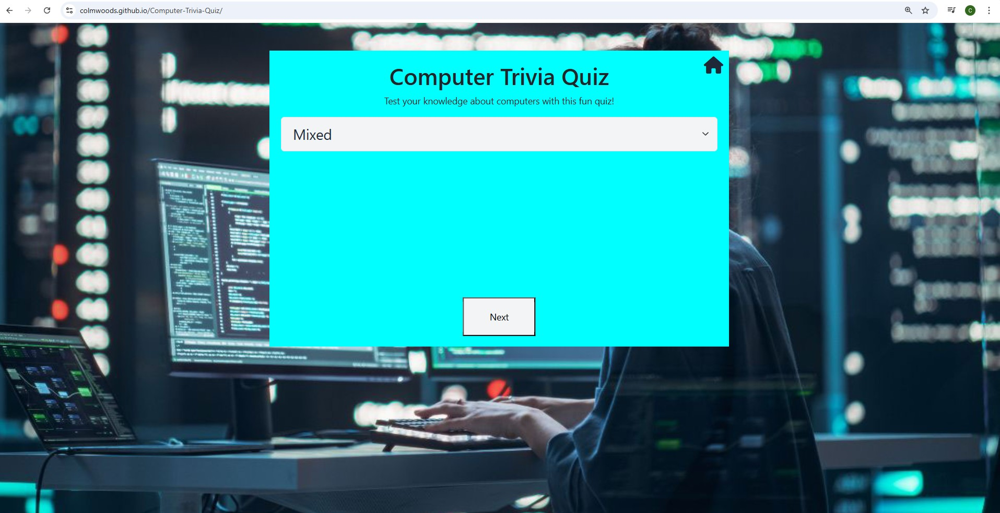

# Computer Trivia Quiz  

The **Computer Trivia Quiz** is a fun, interactive web-based game that tests users on their knowledge of computers and technology. The quiz provides multiple-choice questions with instant feedback, making it both educational and engaging.  

  

Source: [Techsini Multi Device Website Mockup Generator](http://techsini.com/multi-mockup/?url=https://colmwoods.github.io/Computer-Trivia-Quiz/)  

---

## UX  

The strategy was to create a **simple, interactive quiz application** that would:  

- Provide an entertaining way to test computer knowledge.  
- Work seamlessly across desktop, tablet, and mobile devices.  
- Give users instant feedback on their answers.  
- Encourage users to replay and improve their score.  

### Colour Scheme  

- `#1a1a1a` – Background (dark mode feel).  
- `#ffffff` – Text for high contrast readability.  
- `#00bcd4` – Primary accent (buttons, highlights).  
- `#ff5252` – Wrong answer feedback.  
- `#4caf50` – Correct answer feedback.  

---

## User Stories  

### New Users  
- As a player, I want to start the quiz quickly, so I can test my knowledge.  
- As a player, I want clear feedback on each question, so I know when I’m correct or wrong.  
- As a player, I want to see my final score, so I can measure my performance.  

### Returning Users  
- As a player, I want to replay the quiz to improve my score.  
- As a player, I want to challenge friends by sharing the game link.  
- As a player, I want the quiz to feel responsive on any device.  

---

## Wireframes  

Screens were designed responsively for **mobile, tablet, and desktop**.  

### Mobile View  
  

### Tablet View  
  

### Desktop View  
  

---

## Features  

### Start Screen  
- Welcome message with a “Start Quiz” button.  
- Clean UI to encourage players to begin quickly.  

### Questions & Answers  
- Multiple-choice format.  
- Clickable options with instant feedback.  
- Progress bar or question counter.  

### Score Display  
- End screen showing the player’s score out of total questions.  
- Replay option for another attempt.  

### Responsive Design  
- Works on mobile, tablet, and desktop.  

---

### Future Features  

- Add difficulty levels (easy/medium/hard).  
- Timer mode for added challenge.  
- Leaderboard to compare scores with friends.  
- More trivia categories beyond computers.  

---

## Tools & Technologies Used  

-  – version control.  
-  – repository & hosting.  
-  – structure.  
-  – styling & layout.  
-  – quiz logic & interactivity.  
-  – deployment.  

---

## Testing  

> [!NOTE]  
> For full testing documentation, see [TESTING.md](TESTING.md).  

---

## Deployment  

The site was deployed to **GitHub Pages**:  

1. Go to the GitHub repo: [Computer Trivia Quiz](https://github.com/colmwoods/Computer-Trivia-Quiz).  
2. Navigate to **Settings > Pages**.  
3. Select **main branch**, root directory.  
4. Save and refresh – site deployed at:  
   🔗 [Live Site](https://colmwoods.github.io/Computer-Trivia-Quiz/)  

---

### Cloning  

You can clone this repository to create a local copy:  

git clone "https://github.com/colmwoods/Computer-Trivia-Quiz.git"

---

### Forking  

You can fork this repository to make a copy under your own GitHub account, allowing you to freely experiment with changes without affecting the original project.  

1. Go to the GitHub repository: https://github.com/colmwoods/Computer-Trivia-Quiz  
2. In the top-right corner, click the **Fork** button.  
3. A copy of the repository will now exist in your GitHub account.  

---

## Credits  

Content  
- All quiz questions were fetched by a the OpenTDP link provided, With a few of my own fallback question if there is a issue with the OpenTDP link.
- I found this video very helpful for completing the quiz (https://www.youtube.com/watch?v=-cX5jnQgqSM)

Media  
- Icons from https://fontawesome.com  
- Mockup generated using http://techsini.com/multi-mockup/  

Acknowledgements  
- Thanks to Code Institute resources for project guidance.  
- README structure inspired by Matthew Aitken’s template (https://github.com/apeskinian/p1_bgfc).
