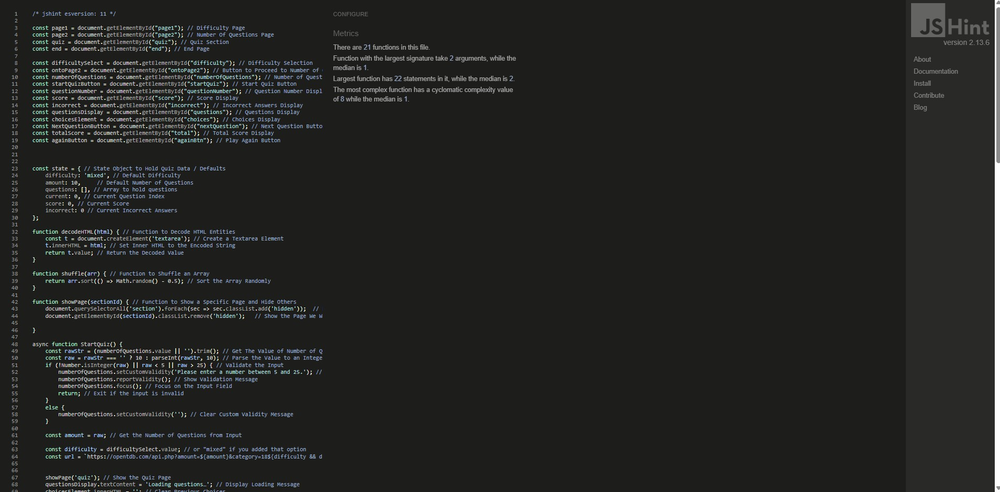

# Testing – Computer Trivia Quiz

This document outlines the testing carried out for the **Computer Trivia Quiz** website to ensure functionality, responsiveness, and accessibility.

---

## Code Validation

### HTML Validation
- All pages were run through the [W3C Markup Validator](https://validator.w3.org/).
- **Result:** Document checking completed. No errors or warnings to show.

### CSS Validation
- Stylesheets were tested with the [W3C CSS Validator](https://jigsaw.w3.org/css-validator/).
- **Result:** No errors found.

### JavaScript Validation
- JavaScript was checked with [JSHint](https://jshint.com/).
- **Result:** No major issues; minor ES6 compatibility notices only.

---

## Accessibility Testing

- Evaluated with [WAVE Web Accessibility Tool](https://wave.webaim.org/).
- All interactive elements are reachable via keyboard (Tab/Enter/Space).
- Clear button labels; semantic headings; images include descriptive `alt` text.
- Colour contrast meets WCAG AA (dark text on light background).
- Focus states are visible and usable.

---

## Responsiveness

- Tested using Chrome DevTools on:
  - **Mobile:** iPhone SE, Pixel 5
  - **Tablet:** iPad, Galaxy Tab
  - **Desktop:** 1920×1080, 1440×900, 1366×768
- Layout adapts with responsive CSS (flexbox/grid).
- Buttons and cards stack neatly on smaller screens.
- No horizontal scrolling on mobile.

### Screenshots
| Device / View           | Screenshot |
|-------------------------|------------|
| Mobile – Quiz Question  |  |
| Tablet – Score Screen   |  |
| Desktop – Quiz Layout   |  |

---

## Browser Compatibility

| Browser | Result |
|--------|--------|
| Chrome | ✅ Works as expected |
| Firefox| ✅ Works as expected |
| Edge   | ✅ Works as expected |
| Safari | ✅ Works as expected |
| Opera  | ✅ Works as expected |

---

## Manual Testing

### Navigation
- **Home:** “Start Quiz” launches the quiz.
- **Quiz:** “Next” loads the next question until completion.
- **End:** Final score displayed with a “Restart” option.

### Quiz Behaviour
- One answer may be selected at a time.
- Correct selection increases score by 1.
- Incorrect selection does not affect score.
- Visual feedback indicates selected/locked state before proceeding.

### Restart
- Restart resets score, index, and re-shuffles questions.

### External Links / Footer
- External links open in a new tab (`target="_blank"` with `rel="noopener noreferrer"`).
- Footer remains readable and accessible across viewports.

---

## Test Cases (Sample)

| Feature | Step(s) | Expected | Actual | Pass |
|--------|---------|---------|--------|------|
| Start Quiz | Click **Start** on home | First question loads | As expected | ✅ |
| Select Answer | Click one option | Option highlighted/locked | As expected | ✅ |
| Score Update | Choose correct answer | Score increments by 1 | As expected | ✅ |
| Next Question | Click **Next** | Next question renders | As expected | ✅ |
| Quiz End | Answer final question | Score + Restart shown | As expected | ✅ |
| Restart | Click **Home Button** | Score resets, start again at question 1 | As expected | ✅ |
| Mobile Layout | iPhone SE viewport | No overflow; stacked UI | As expected | ✅ |

---

## Bugs and Fixes

### Fixed Bugs
- **Questions not shuffling**
  - *Issue:* Same order on every run.
  - *Fix:* Implemented pre-render shuffle for the questions array.

- **Score not incrementing**
  - *Issue:* Correct answers didn’t update score.
  - *Fix:* Corrected comparison logic before increment.

- **Restart not clearing state**
  - *Issue:* Old score/question persisted.
  - *Fix:* Added `resetQuiz()` to clear state and re-initialise.

- **Constants declared incorrectly**
  - *Issue:* Some `const` variables were declared at the very top of the JavaScript file instead of inside the function where they were needed. This caused scope issues and variables being undefined when the quiz was running.  
  - *Fix:* Moved relevant `const` declarations inside their functions so they are only created when required.  

- **Incorrect handling of API answers**
  - *Issue:* Initially, the code used a variable `answers` but the OpenTDB API provides `correct_answer` and `incorrect_answers`. This mismatch caused the quiz to fail when rendering options.  
  - *Fix:* Updated the code to properly combine `correct_answer` with the `incorrect_answers` array when building the multiple-choice options.  

- **Button class misapplied**
  - *Issue:* The code used `button.classList.add(incorrect)` instead of `button.classList.add('incorrect')`. Without quotes, it looked for a variable instead of adding the string class name.  
  - *Fix:* Wrapped class names in quotes so the correct CSS classes are applied (`'correct'` or `'incorrect'`).  

- **Normalisation of variables**
  - *Issue:* In some cases, the correct answer string from the API did not match exactly due to HTML entities or casing differences, meaning right answers were marked as wrong.  
  - *Fix:* Normalised values using entity decoding and string comparison to ensure correct answers are recognised even if formatting differs.  

- **Shuffled answers overwriting correct answer**
  - *Issue:* When shuffling the answer array, the variable `correctAnswer` was being reassigned incorrectly, leading to wrong comparisons.  
  - *Fix:* Changed logic so that `correctAnswer` is always taken directly from the API field `correct_answer` and never overwritten by the shuffled array.  

### Known Issues
- **No persistent scores:** Results are not saved after page reload. (Future: LocalStorage or backend API.)
- **Accessibility enhancements:** Add more ARIA live regions for dynamic updates (e.g., announcing score changes).
- **No difficulty/timer modes:** Could add countdown per question.

---

## Lighthouse Testing (Chrome DevTools)

Lighthouse audits were run on the deployed site.

| Category        | Score |
|-----------------|-------|
| Performance     | 100% |
| Accessibility   | 83%   |
| Best Practices  | 78%  |
| SEO             | 100%  |

*(Scores may vary slightly by device/network.)*

---

## User Story Testing

### New Users
- Can find and start the quiz quickly ✅
- Can answer multiple-choice questions ✅
- Can view total score at completion ✅

### Returning Users
- Can replay the quiz to improve score ✅
- Can navigate easily on mobile and desktop ✅
- Can share results manually (no built-in share yet) ✅

---

## Conclusion

The **Computer Trivia Quiz** functions reliably across devices and modern browsers, meets accessibility basics, and passes validation checks. All critical issues have been addressed. Future improvements include persistent scoring, ARIA live announcements for dynamic content, difficulty selection, and an optional timer mode.
